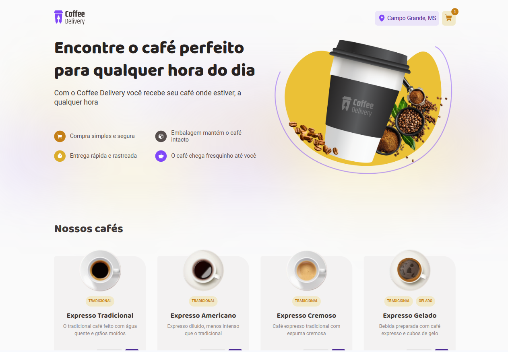
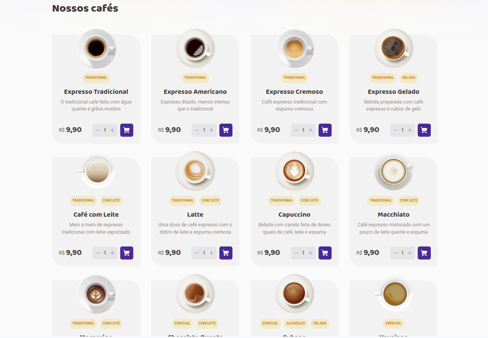
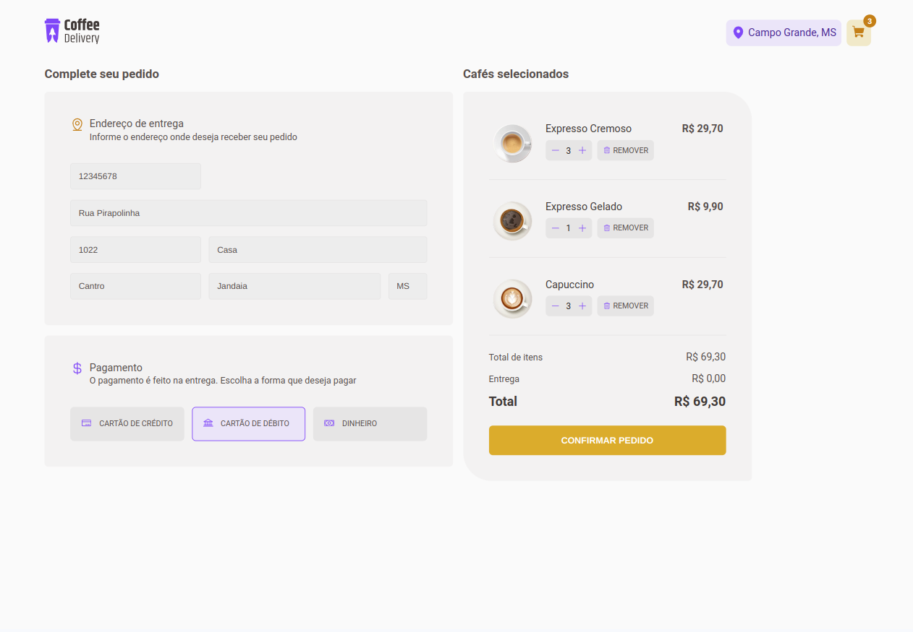

# Projeto Coffee Delivery

#### 🚀 Projeto Desenvolvido com Vite e Typescript utilizando o local storage para gerenciar o carrinho e styled-components para a estilização.

O desafio era desenvolver uma aplicação para gerenciar um carrinho de compras de uma cafeteria fictícia, que contenha as seguintes funcionalidades:

-   [x] Listagem de produtos (cafés) disponíveis para compra;
-   [x] Adicionar uma quantidade específicas de itens no carrinho;
-   [x] Exibir o total de itens no carrinho no Header;
-   [x] Exibir o valor total da soma de itens no carrinho multiplicados pelo valor;
-   [x] Validar form de endereço de entrega;
-   [x] Adicionar pagina de sucesso.

## 🖥️ Pré-requisitos e como rodar a aplicação/testes

Antes de começar, você vai precisar ter instalado em sua máquina as seguintes ferramentas:
[Git](https://git-scm.com)

### 📋 Instruções

-   Clone esse repositório `git clone`
-   Instale as dependências, `npm install`
-   No terminal, digite o comando `npm run dev`

## 🤖 Tecnologias Utilizadas

## 🖼️ Demonstração da aplicação

## 🚧 Status do projeto

Adicionando Testes na aplicação

Visualização do site:
[Deploy na Vercel](https://coffe-delivery-pink.vercel.app/)

## 🧑🏻‍ Autor

Feito por Felipe Soares

